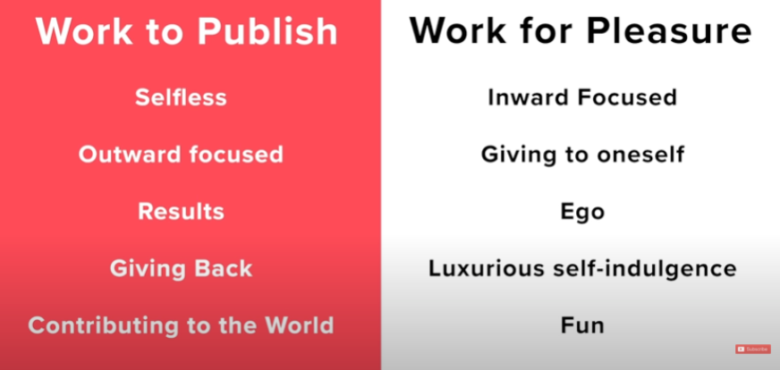

I feel like I'm a slow researcher. I read slow, I write slow, I review my writing slow, you get the idea. I should probably start the "slow research movement." For a while, I turned to academic "media" to see whether this was normal. I am a regular consumer of [The Chronicle of Higher Education](https://www.chronicle.com/), podcasts such as [The Effort Report](https://effortreport.libsyn.com/) and [AcaDames](https://www.acadamespodcast.com/episodes), and whatever [The Professor is In](https://www.facebook.com/TheProfessorIsIn) is doing on social media. I also read books like [How to write a lot: A Practical Guide to Productive Academic Writing](https://www.amazon.com/-/es/Paul-J-Silvia/dp/1433829738/ref=pd_lpo_14_t_0/139-8005541-4099351?_encoding=UTF8&pd_rd_i=1433829738&pd_rd_r=cd3071f8-d0af-42c5-89fa-52a8af47bcd6&pd_rd_w=c7FdZ&pd_rd_wg=yJDpw&pf_rd_p=16b28406-aa34-451d-8a2e-b3930ada000c&pf_rd_r=EB57K7EK0WM9Z7V5JHT4&psc=1&refRID=EB57K7EK0WM9Z7V5JHT4) or [The Writing Workshop: Write More, Write Better, Be Happier in Academia](https://osf.io/n8pc3/) (which I highly recommend, and it's free!). It turns out that I'm normal, but the question still lingers in my mind.

Recently, I've found myself looking at other outlets beyond academia. In particular, I've started following some content creators on YouTube. I got here because, around a year ago, my brother told me that he watches YouTube. He doesn't watch Netflix, he watches Youtube, and apparently, this is something younger people do. I also wanted to be a cool kid and I started watching a few YouTube channels he pointed out.

One of the channels was [JackConteExtras](https://www.youtube.com/user/JackConteExtras). Jack Conte is a musician and the founder of Patreon, a platform connecting content creators with their followers. He uses this channel to talk about his creative process. [This video](https://www.youtube.com/watch?v=5EuWCFCgy58&t) stood out to me because of the parallelisms between his music creation process and our research process. 

<iframe width="560" height="315" src="https://www.youtube.com/embed/5EuWCFCgy58" title="YouTube video player" frameborder="0" allow="accelerometer; autoplay; clipboard-write; encrypted-media; gyroscope; picture-in-picture" allowfullscreen></iframe>

He tells the story about how he obsessively worked on getting the kick drum in one of his songs to make it "bright enough." Days working in his study to fix a minute detail. Does it sound familiar? Replace "kick drum" with "research question" or "discussion paragraph" and you are describing where many researchers get stuck. Importantly, Jack noticed that he had a problem. Jack and I found out that we have the same problem.

He attributes this issue to the impossibility of finding an end to the creative process. If you are playing soccer, it's easy to find the end. There is a big-timer visible at all times and rules in case of a tie. Finishing a game feels like an end. However, finishing a song for him, a paper for us, feels nothing like an end. Jack makes this distinction between working to publish and working for pleasure.

This explanation seems pretty logical: either you focus on getting things "out there" or you focus on "having fun". But this is not how it feels to me. I've come to understand that, for me, getting stuck is linked to perfectionism, and this could not be any further pleasure. But I'll talk about perfectionism another day.

What do we do about it? If you haven't noticed yet, I'm very pragmatic and like to jump into solutions and results. It turns out that many things don't work like that. After a couple of years of therapy and meditation, I'm still working on figuring out how perfectionism has hampered my progress. Nonetheless, I do believe there are a few practical takeaways from Jack's video.

- "Publishing is a style of work, an attitude that persists over the creative process"

He defines publishing as the process of "deciding to stop when you want to keep going, and it is painful". Importantly, he notices that people who produce massive amounts of content, do so because they don't "finish" things, they "publish" them. This is an idea that I've encountered in other places like [this interview with Seth Godin](https://open.spotify.com/episode/4Q1SPppkreCKcqYUy0ppQH?si=GSERrIY-SRyUA4mo1J7p6A&dl_branch=1). He explains that he just writes a blog post every day, without questioning whether it is good enough, he just writes it. In the words of Jack, "Your whole mentality shifts when you work to publish".

- "Do only what matters and then stop"

This is probably the trickiest part. How can we draw the line between obsessing about a paper and making sure it is good quality? I probably have more questions than answers, but I sense that the key is 1. committing to publishing as a style of work, and 2. being clear about the goal. Thinking about our main objective will help us not lose sight of what we want to accomplish. For instance, when writing a paper, have we made sure our conclusions are contributions to the field are clear? If yes, then maybe spending 5 hours tinkering with the graphs on R to make them crisper is not worth it.

- "The world is made of funnels"

The basic idea behind the funnel theory is that we need to create a lot and eventually some of it will be successful. We tend to admire people who produce high-quality work and assume they just do great stuff. What we fail to see is that they often do a lot of stuff and some of it happens to be great. This is true for singers, painters, movie directors, and researchers too! The video mentions that we cannot choose what we are famous for. I initially thought that this is a point where music and research differ, because of the "high standards" research demands. You cannot submit for publication the first random research idea that crosses your mind because it will get rejected. But the more I think about it, the more I realize research is not different. Senior researchers say that their most cited paper is often not the one they would have thought of or the one they spent more time on.

Whenever I come up with a potential research idea, my brain immediately finds all the reasons why I should not do it (I don't know enough about it, it's not good enough, nobody will care about it, why am I even here?). I've been thinking a lot about how this thinking pattern has been a form of self-sabotage. This blog an attempt to break out of that pattern 🤭 Let me know if you have experienced anything similar and we can have our mini-therapy club. In the meantime, remember what Jack told us: "you cannot choose what you are famous for" but you can choose to be "prolific, creative, create great stuff and work to publish".