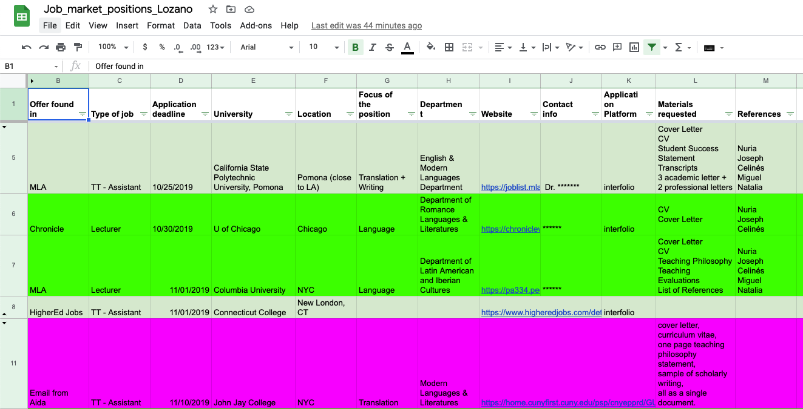
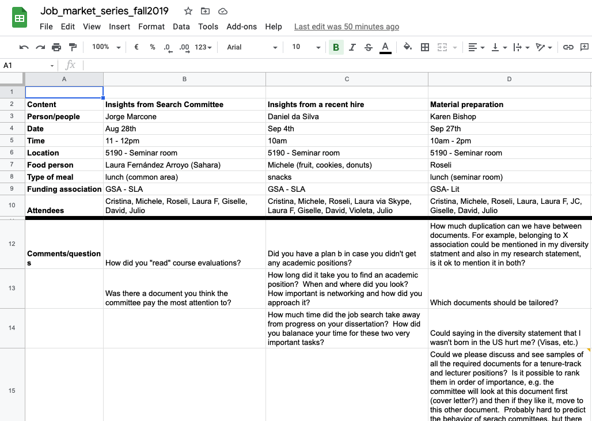

A friend and former colleague recently message me where I looked for jobs. I sent him a quick list of sites I could think at the top of my mind. I thought my answer was pretty insubstantial, but it turned out he didn't know about the sites I mentioned, so I figured I would write about it and let anyone interested know. I told him I could write a blog post about it, and he suggested a: where, how, and when looking for jobs. So here it is.

Let me give you some background on my journey to landing a tenure track job. In my 4th year as a Ph.D. student, I started preparing materials for the job market and sent applications to two jobs. Location was very important to me, so I only applied to the two that were located in the area where I was interested. They were both lecturer positions (for those unfamiliar with terminology: teaching, non-tenure track, non-research). That year, I was hoping I would get an extension on my Ph.D. program (it's supposed to be 4 years, although most people take a bit longer), and I didn't put much effort into preparing the materials. What do I mean by much effort? I wrote them (which is very time-consuming), and they underwent one round of comments from my advisor (who was not very keen on me leaving the department that year, she wanted me to stay for another year). So the first year I sent a total of two applications with materials that had not been heavily vetted. You can guess the result: 0 answers. The good news was that I got a nice competitive fellowship for my fifth year.

### When

Fast forward to my second year on the job market, I knew the story had to be different. Let's start with the when. You should have your materials ready before the semester starts, the summer before you are on the market, you should be spending a significant amount of time writing and reviewing your materials. Jobs will start coming out in September, but don't freak out if there's nothing on your specific area of expertise during September because they will keep coming out until mid-November (I'm not including post-docs here because 1. I barely applied to any, 2. they don't always follow the same calendar). Also, visiting positions will come out later, during the Spring semester (March/April). We observed a new trend of certain universities posting their jobs earlier than what it used to be normal to get the best candidates early in the game. This means that you need your materials in a pristine state by early September.

### Where

Now that you know when jobs come out, where do you look for them? Here is a list of what I used (and this list is probably also useful for professors who have an upcoming opening, you know where to advertise them). Note that these websites are mostly for the US and Canada. 

- [The Chronicle of Higher Education](https://jobs.chronicle.com/) & [Higher ed jobs](https://www.higheredjobs.com/): these two sites have academic jobs in every field. They are very intuitive and user-friendly.
- [LinguistList](https://linguistlist.org/): this is a mailing list specialized in linguistics. Here you might also find some jobs in Europe. If you are not a linguist, figure out which is the main mailing list for your server and they will also have jobs.
- [AATSP](https://jobs.aatsp.org/home/index.cfm?): this one gets even more specialized. It's the American Association of Teachers of Spanish & Portuguese and they also have a jobs section. Again, if this is not your field, look for professional or teacher associations, they might also have a jobs section.
- [LinkedIn](https://www.linkedin.com/feed/): I wouldn't spend much time here, it's too broad and I think most universities don't post here. But it's worth having a look. However, if you are looking for jobs outside the US or industry jobs, this is a good resource (I just opened it while writing this post and saw that DuoLingo is looking for an intern, make sure you follow the right people to see those positions). If you are using it, make sure your profile is in good shape.
- [The wiki](https://academicjobs.wikia.org/wiki/Academic_Jobs_Wiki#Application_Year_2021-2022): most fields have a wiki where people post new positions, but also whether they've been called for an interview, a campus visit, etc. This has a lot of information, but some people get obsessed and overthink it. Moreover, it is based on anonymous contributions. I have the impression that most are nice and honest, but people can lie (for reason I still don't understand). If you have obsessive, tendencies, you might want to skip this one.

For all these sites, you can create alerts. That way, every there is a new posting, you'll get an email. Well, maybe don't do it with the wiki, you might go crazy if you get comments every time some adds information. But don't feel the need of creating the alert. If you check the sites a couple of times a week, it's also enough. Know what suits your personality best. And don't forget about your network. Everyone should know that you are looking for a job, they will send you posts that might fit your profile. 

### How

- Create a system: If you want to land a job, you are going to have to send tons of applications. Tons can mean different things in every field. In my field (Hispanic Linguistics), I have the impression that people send between 40 and 50 (all academic, mostly tenure-track, some lecturer and postdocs). A good friend of mine was in economics and he sent over 120 applications (both academic and non-academic). My point here is that you are going to need a system. I kept track of all applications on a spreadsheet on google docs, which I shared with the professors who were sending my letters of recommendation. Here's a screenshot of how it looked by the end. Light green = submitted, bright green = Skype interview, purple = campus visit.

   

- Workshops: attend a few workshops about how to prepare. Pay attention to who is giving the workshop, because that is the perspective you are going to get. During my job market year, the professor in my department who used to give the workshop had been on sabbatical, so we didn't get the workshop the previous spring. Given that we didn't have that resource, I decided to organize a series of workshops. The bottom line here is: if they don't offer them, you can organize them. I invited a senior faculty member, the professor who's usually in charge of this (she was back! 🙏), and the newest faculty member. Everyone offered a different and valuable perspective. Here's the non-fancy spreadsheet I used to organize speakers, times, attendees, and questions.

   

  One more note on workshops. If you are like me, you will feel compelled to go to all the possibly imaginable workshops offered within a 50-mile radius. Don't. Select a few, make sure whoever gives them is competent, and then be confident that you did your job. The last workshops I attended (not the ones I'm mentioning here, others organized by the university) did not add anything new to what I already knew.

- Feedback: you want to have feedback from your advisor and a few other people. Maybe someone you know is good and experienced at giving feedback. A person outside of your field would be nice too, particularly if that profile is going to be on your search committee. People in your cohort who are on the job market can also give you good feedback, they are sucking all types of information to improve their materials and can give you good comments. But, same as with workshops, don't go overboard. At some point, you are going to get contradictory feedback, and you will be the one making the decision. Don't forget that your materials are supposed to represent you. This is good preparation for what lies ahead on the other side of your Ph.D. defense. You will be the one making the decisions.
- Interfolio & recommendation letters:  you don't need to pay for interfolio, although if you do, it might make your life easier when it comes to handling your letters of recommendation. I didn't pay for it, so I cannot offer you much advice on that end. Letters can be tricky, make sure you give your recommenders **plenty** of time. You don't want to miss a deadline because your letter didn't arrive, so go ahead and contact them now. Tell them what your plans are (what type of jobs, where, etc.). These letters are long and take time to write, it's only fair that you give them time.

I'm very happy my friend sent me the question formulated as when, where, and how. I wasn't thinking of the how and I just realized it's the glue that connects everything. This process will be probably new for most of you, it involves a lot of insecurity and uncertainty. Here, I'm giving you a plan, if you stick to it (and you did your homework building your CV throughout your Ph.D. studies), you can at least feel confident that you did a good job. The result is never guaranteed, but for sure you will learn with the process. Happy to take more questions you might have about looking for academic positions!
