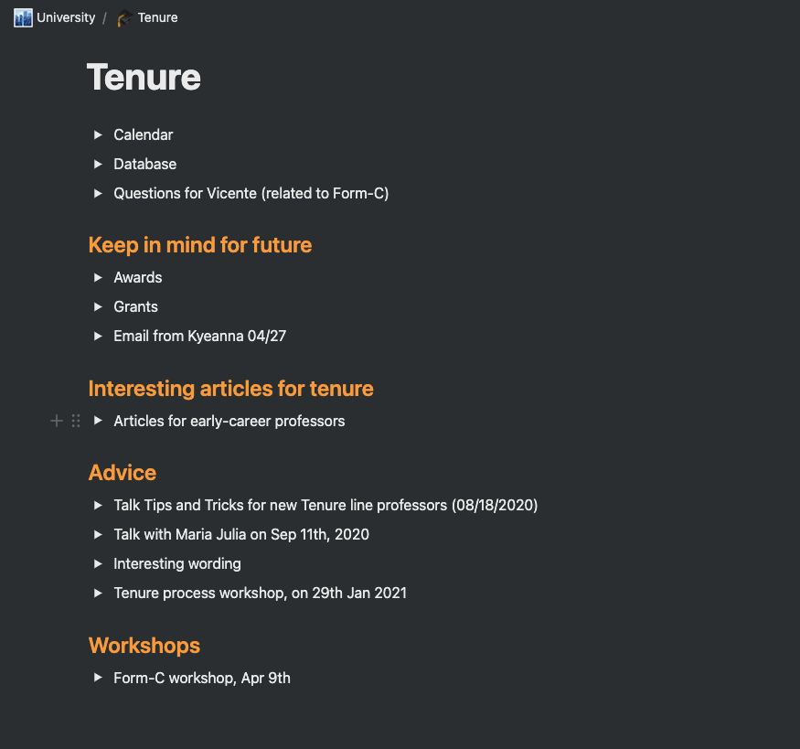
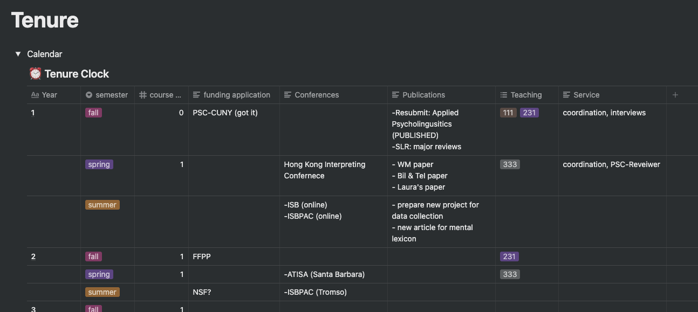
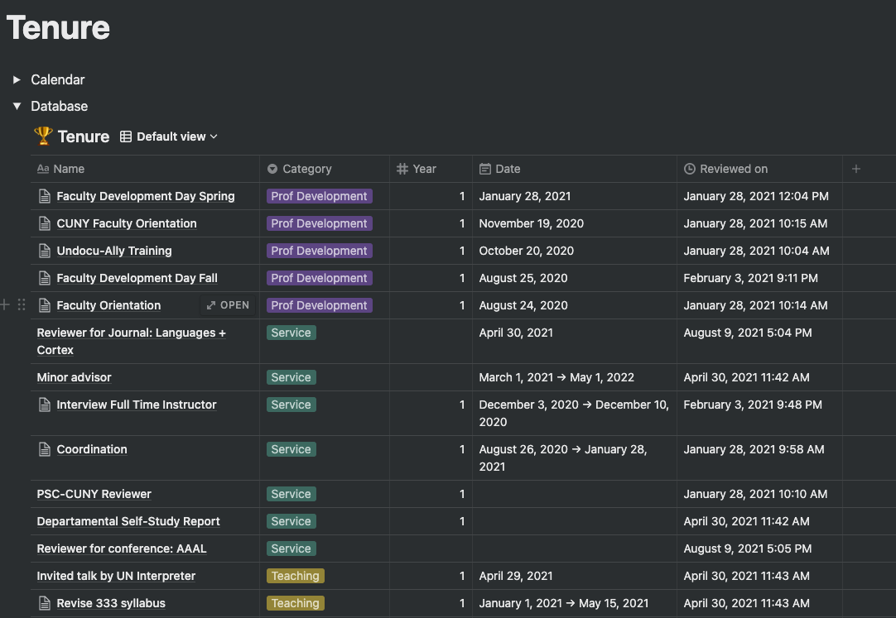

On my [last post](https://crislozano.me/post/why-plan/) I wrote about why it is crucial to make a plan, even if you later change it. Here I show you what my plan looks like and how I keep track of it. I struggle to make long-term plans. When I first moved to the US (10 years ago!), I was asked what I wanted to do the following year. I was startled by the question, I had just arrived in Indiana, and thinking about what would happen next seemed impossible. But the professor who asked me that question was right, if I wanted to have options, it was the moment to start planning. I've recently figured out that my personality has a lot to do with it. I need to have information before making decisions. So when I get somewhere, I need some time to observe, gather data, and then decide. This is probably why statements like "this is the best pizza in NY" drive me nuts. I want to see a spreadsheet full of data that leads you to that statement. And this is wrong. It's paralyzing and doesn't let you move forward. One needs to find the balance between absorbing relevant cues in the environment and not getting too caught up in gathering infinite information. And this is where a good plan comes in handy.

In [Chapter 2: Planning Your Time,](https://osf.io/n8pc3/) from The Writing Workshop, Prof. Barbara Sarnecka explains the different levels of planning you need: the big picture (5-year plan), term plan (semester/quarter, whatever suits your calendar year better), and a weekly plan. But before getting to those plans, Sarnecka prepares your mindset. Following the plan, as opposed to just devising it, requires adopting a specific 

- Think like a CEO, not a factory employee (more on this in the next post)
- Distinguish between urgent and important: this is particularly important when dealing with other people's requests. Just because it's urgent for another person, it doesn't make it important for you. Their lack of preparation on a project does not have to derail your plan.
- Accept that not everything will get done: and now that you know that not everything will fit in your day, use the previous step and don't let the urgent push the important away.

As a new assistant professor, one of the first pieces of advice I received was: document everything you are doing. I thought this could be a messy process, so I came up with a system. I'm now finishing writing my first-year report, and it has been very useful to have everything in one place. Here is what I did to both create a tenure plan and keep track of all my work. I used Notion and if you haven't heard of this app, it's without any doubt my favorite. I'm kind of addicted to trying these things, I've played with Todoist, Trello, Evernote... you name it. Notion is the perfect combination of all of them but easy enough to navigate (there's another called Roam that makes my head spin). The best part, if you are in academia, you can get the premium account with your .edu email. 

I have a page where I organize my work-related things that looks like this

And since we're focusing on planning, let's check my Tenure page

The triangles (called toggles in the app) allow you to collapse information and if we open the calendar, this is what I see

And here's my work database (a lifesaver for writing up your tenure file)

If the app is new to you, I foresee two reactions: 1. this is overwhelming, or 2. this will save me. It indeed takes a bit of practice to get used to Notion and understanding all its features (or at least figuring out which ones are relevant for you). Leave me a comment if this is your case and want me to make a video on how Notion works. But the app is not going to save you, it's just a tool to make your life easier. Remember how the chapter I discussed earlier started by the mindset? You can use a notebook to do exactly the same. I happen to like these apps and the flexibility of having all the information with me at all times. The key here is creating a plan and keeping track of it. I tend to feel as if I was wasting my time for 70% of the day. But when I look at that table full of things I did during my first year, I realize that's just simply not true. Our minds are not wired for happiness, they are wired for survival and they naturally focus on the negative. Seeing the good takes practice and keeping track of it...just helps. Oh! [here is the template](https://toothsome-whippet-cd2.notion.site/Tenure-clock-8123ebbfbaa344b58ad8d0ac33dfc805), in case you want to steal it 😉

