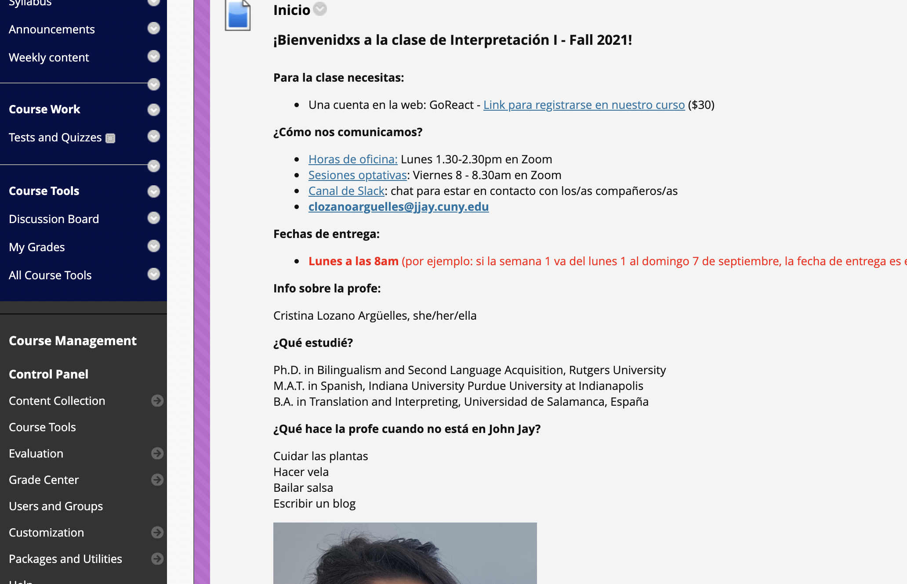
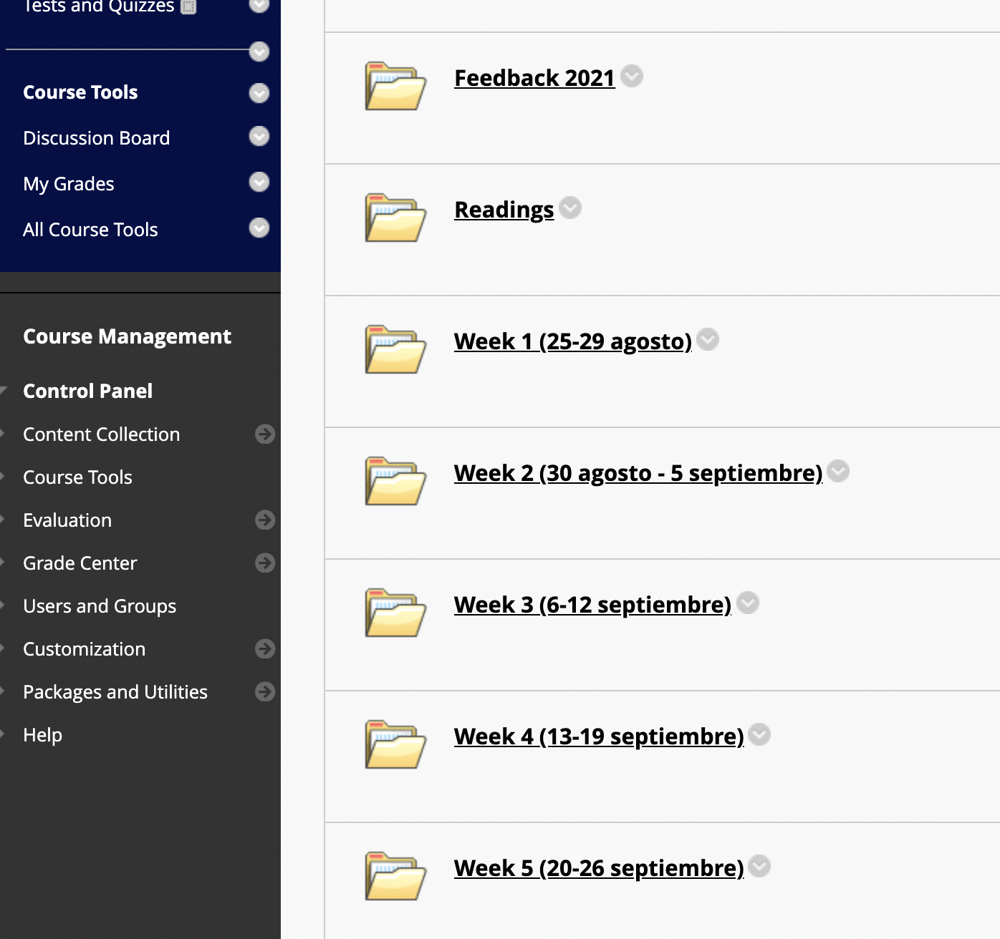
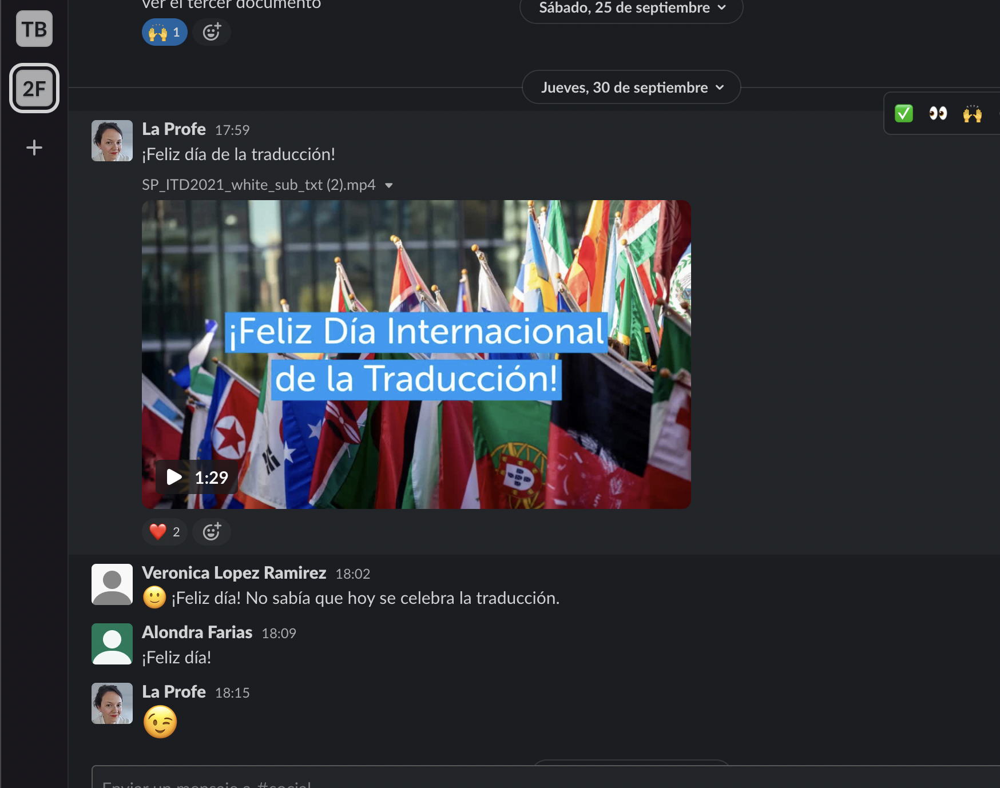
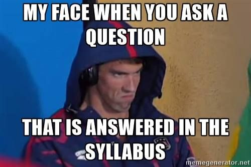
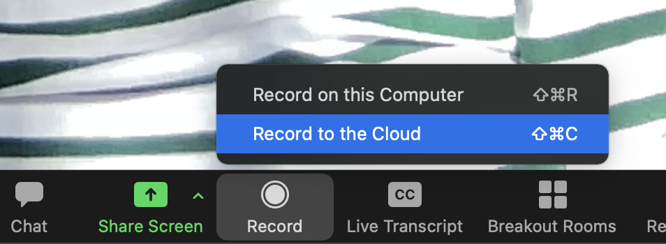
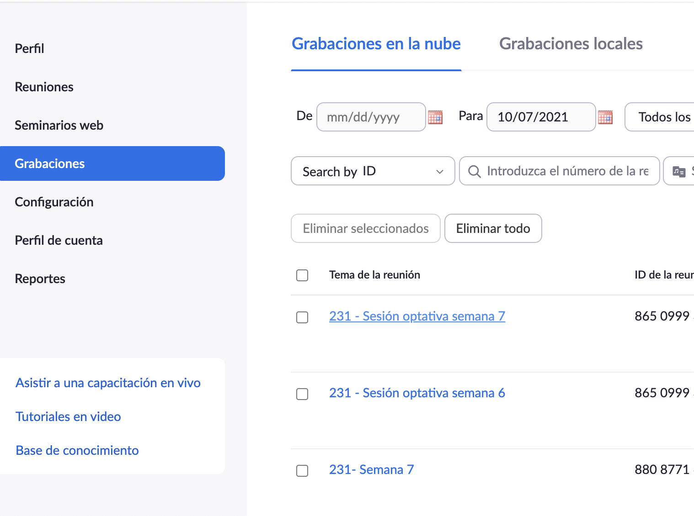

Part of my job at the university is coordinating lower-level language courses and supporting our part-time instructors. Over the last months, I've noticed that asynchronous online teaching causes the most anxiety among instructors. For the uninitiated in online teaching, we usually divide courses into synchronous, where the class meets "live" over a platform (e.g., Zoom), and asynchronous, where students complete assignments on their own time. 

When COVID hit in the middle of the Spring semester in 2020, everyone tried their best teaching over zoom. Most courses were synchronous, the natural adaptation was keeping the same schedule and meeting through an online platform. Fall 2020 brought new challenges, such as figuring out which modality (synchronous, asynchronous, or hybrid) was best. Different factors play into how to make this decision for each course. First, the decision has obvious implications for schedule planning. Administrators need to ensure that students can complete class sequences and requirements on time. Second, different subjects might be more suitable for one modality or another. And third, most importantly, the instructor's preference. Why the most important? When instructors are not comfortable or trained to teach on a specific modality, the content of the class will suffer and students will pay the consequences.

Unsurprisingly, over the last year, I've noticed that asynchronous courses are scary for instructors. This modality is further away from traditional face-to-face courses and involves a great deal of "translation". Here are a few of the doubts I received:  

>I don't really know what the expectation is. Do the students just do all of the homework and video lessons? Am I supposed to record lectures? Are the students supposed to film themselves or record themselves speaking?

And we could even go into more big-picture questions: How can we create a community of learners? How do we recreate class discussion? How do send reminders and warnings? Answering all these questions requires training and careful planning. Untrained instructors even doubt it is possible to teach asynchronously, how effective can be a course whose instructor believes it is useless? 

I have met with a couple of instructors in our department to explain to them how I organize my courses and I figured out other people might want to see it as well.

## Home page

I don't know about your institution, but mine gives me a course landing page that is crowded with information nobody uses or needs. In my home page, I've embraced minimalism in online courses. Give your students the bare minimum to get started and to get to know you. 
I include links (and schedule) to office hours, optional live sessions, my email, technical support, and a brief introduction of myself. Period. They don't usually need links to all the repositories they can find at the library or the McGraw-Hill tool that nobody knows what it is for.

I've been surveying my students and I have the impression that the social media they use the most is Instagram. When you are on Instagram, you are seeing one picture with one comment. That's it. Then you have menus and options. But the main thing is fairly simple. Why? It gets your attention, and we know that [Facebook companies would do anything to get your attention](https://podcasts.google.com/feed/aHR0cHM6Ly9mZWVkcy5zaW1wbGVjYXN0LmNvbS81NG5BR2NJbA/episode/MTJiYjY1NDAtZmJmMy00NGQ2LWI1NjAtNmQwNTBiMGRlZmUw?hl=es-US&ved=2ahUKEwiuuKieurjzAhUUZjUKHYAkCg4QieUEegQIBBAI&ep=6) 😬 Think about when you visit those websites full of pop-ups and ads moving around the screen, isn't it the most annoying thing ever? I feel like a crowded landing page has the same effect on students. It's overwhelming and it makes you want to run away.

## Weekly assignments

Now, how do I organize my materials? The specific tool is going to depend on the platform you are using. But the idea can be implemented in any of them. In my case, it's Blackboard (don't tell anyone that I hate it 🤫). I create a new section on the left menu and call it weekly assignments. Inside that menu, there are folders with instructions for each week, and I also include the dates for that week (this was a suggestion of a former student). Notice that including the dates will involve changing the dates the next time you teach the course, but more on this later. Other platforms such as Canvas (CUNY, if you're reading, I'm giving you hints here 🙏🏼) have more user-friendly ways of organizing the information: modules that are easy to navigate and you can even make them sequential, such that students cannot move forward until they complete a specific assignment.

On a typical week, I include a summary video (2-4 minutes), a lecture video (never ever more than 15 minutes), reading + forum on the reading, and an assignment (in my case, simultaneous interpreting, but think about what they would do on a regular week). They love short videos. 

## Group work

I've given workshops on how to organize group work in online courses, but I'll keep it short. Do not assign group work in the first 2 weeks of class. Use them to organize the groups. I've tried a couple of methods: 
1. Using the forum tool of your platform.
2. Slack (here's a picture of how Slack looks like)

Ask students to post a message saying when they can meet (i.e., weekends at 5 am, a very popular time). They should assign a leader (who will be in charge of recording the sessions and uploading them), and write the names of the people of the group as well as the time/days they meet on a google doc. This makes it easy for the professor to keep track of the groups and, if for whatever reason a student cannot make it to their group meeting, they can see when other groups meet and join one. I would suggest they use zoom to record the meeting, and then you can create a google doc folder where they upload them. This saves you from having to deal with big video files as you can watch them on the folder without downloading them.

## Repetition

During in-person classes, professors present the syllabus, explain deadlines, and when the deadline gets closer, they remind students about it during class: "remember next week you'll submit your first essay", "don't forget about the midterm in two weeks". Online is the same. You have to repeat things, so think about how you are going to do it because otherwise, this will probably happen

I send announcements (a couple a week) and I send some messages on slack. I don't trust that all of them check slack, so if it's something important, it goes to announcements. 

## Maintenance

Organizing everything I've mentioned is a lot of work, indeed. But once you have it, it's ready to go and you just have to tinker with it. One thing I would advise you is keeping your text and videos as timeless as you can. For my lectures, I don't mention whether it is Spring break, Christmas, or anything that has been on the news. If you do that, you'll have to record them again because the next time you teach the course, it won't be the same piece of news. However, for the introductory videos, I do mention current events. I update these videos every time I teach the course, so it makes sense. 

Whenever you put dates, be aware that you'll have to update them. In the case of the weekly folders, I do think it'll be useful for students to see the date there, and I take the extra time to change them every semester. You can assess what adds value and what's not worth it.

## Videos

I've been unsuccessfully trying to get into video editing for a while (I'll get you dinner if you want to teach me the basics). Hence, I don't edit anything and I keep it as low-tech as I can. I record them using zoom (but I do have a ring light 🙃). I create a new zoom meeting, hit record on the cloud (again, saving you from having to deal with big video files) 

Then you go to your account on the web, find your recordings and there it is. You can change the name (you should, something that allows you to easily find it later, I put the course code and the week), and you get a link that you can then paste on your weekly assignments. Make sure that you either make the recording public or share the password with your students. 

I think with this, you should be able to create a solid structure for your course. A while back [I also wrote about what I learned from online teaching](https://crislozano.me/post/online-pandemic-lessons/), you might find it interesting. Let me know if you want to know about any other aspect of online teaching.
