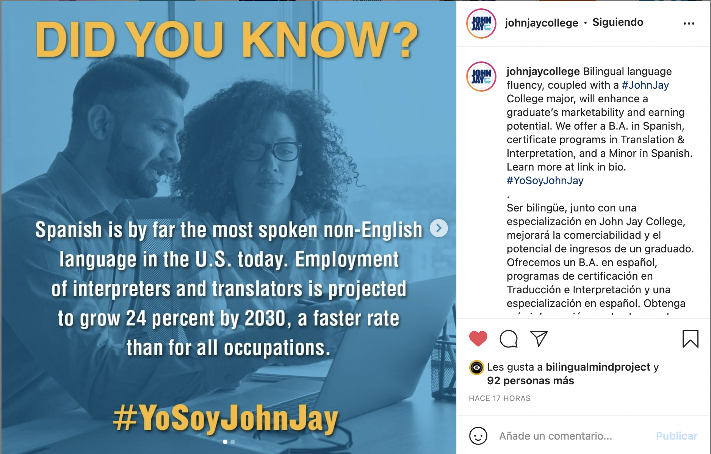

A couple of years ago, when I was preparing and sending job applications, differences in class titles got my attention. Some of them were intriguing, others were straight to the point. First, I realized I needed to account for this difference in my job materials. But more recently, I've been thinking about how dangerous this is. Let me start with the job materials.

Class titles can be a window into the department’s culture. While many private schools offer courses like "Great Latin American Artists (That Never Existed)", "The End of Monuments", or "Sketching Modernity"; public schools often have classes like "Spanish for Health Care Personnel", "Introduction to Translation", or "Introduction to Hispanic Culture". These titles reflect what the department is trying to accomplish. The former seeks to train well-rounded global citizens, the latter wants students to get jobs. If you are applying for a position that requires you to teach, it’s a good idea to mention in your cover letter the courses you would be qualified to teach and also the courses you could add to their offering. Here is when noticing the difference between the two types comes into play. Remember that part of being a good candidate is fitting in the university’s culture and your materials should reflect that you understand what the department is trying to accomplish, you are going to connect both with the students and with your colleagues. This would be going for an A, if you want the A+, keep reading.

Beyond course titles, I noticed this difference correlated with the institution's mission and their interest in online education (2 years ago, before COVID). Wealthy private schools want to show their uniqueness, their potential in educating well-rounded citizens who will change the world. Most of their student body comes from a privileged background and there is no doubt they are going to get a job. This uniqueness needs to be conveyed in person, they had no intereste whatsoever in online classes. On the other hand, some public schools serve a student body that comes from a low socio-economic background and their mission is to move those students up the socio-economic ladder. Just to give you an example from a [recent Instagram post](https://www.instagram.com/p/CVOQwjZta-6/) at my institution, where the caption includes the following "Bilingual language fluency, coupled with a #JohnJay College major, will enhance a graduate’s marketability and earning potential." Online courses were very attractive for these schools. Their students often have jobs and online courses allow them to combine school and work.

I used to see this as fact. If you want to get a job at an elite institution, you propose a mysterious-sounding course. On the contrary, if you are applying for a job at a public institution (I know I'm simplifying the categories, and not all public institutions are like CUNY), you propose a straightforward sounding course that will get students a job. 

But like I mentioned earlier, I’m now realizing how dangerous this is. The basic premise of book I’m currently reading (The Linchpin, by Seth Godin) is that the successful workers of the future (and the present) will be the those capable of seeing things differently, of making a map instead of following one. The author elaborates on the qualities of what he calls "linchpins", those people willing to take a different route and make a difference, not by following the system, but by improving it. My mind tends to make connections between what I'm reading and my students. How is this related to education? Check out this quote:

“We want one class of persons to have a liberal education, and we want another class of persons, a very much larger class, of necessity, in every society, to forgo the privileges of a liberal education and fit themselves to perform specific difficult manual tasks.”

Those of us working in public universities whose mission is to act as [the economic mobility engine](https://www1.cuny.edu/mu/forum/2020/06/17/new-study-confirms-cunys-power-as-national-engine-of-economic-mobility/#:~:text=New%20Study%20Confirms%20CUNY's%20Power%20As%20National%20Engine%20Of%20Economic%20Mobility,-June%2017%2C%202020&text=A%20new%20report%20from%20the,students%20into%20the%20middle%20class.), need to be aware of this. If you are applying for a job in a public institution, you also need to be thinking about this. I would encourage you to think about how that course you want to add to the department is not only going to train students to get a job but will also make them valuable citizens that will bring a new perspective to their future jobs.  If you want to go for the A+ in your cover letter, add that mysterious-sounding course that will get students excited, and explain to the seach committee how it's going to not only help them get jobs but also help them make valuable contributions to society, to change how things have been done traditionally. How do you do that? There were also some interesting suggestions in the book:

>What They Should Teach in School Only two things: 1. Solve interesting problems 2. Lead.
“Interesting” is the key word. Answering questions like “When was the War of 1812?” is a useless skill in an always-on Wikipedia world. It’s far more useful to be able to answer the kind of question for which using Google won’t help. Questions like, “What should I do next?”

I would love to work with a colleague who wants to guide our students to be linchpins, who believes they have great potential to offer and believes in the mission of helping them realize they have all that potential. We are going to be hiring soon at my department, just saying 😉
